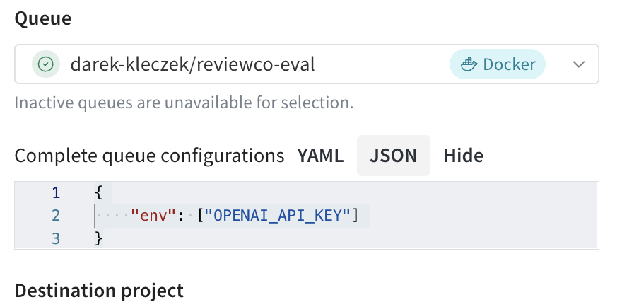

# Enterprise Model Management Course

This course on enterprise model management, led by Hamel Husain, covers the fundamentals of model management using the Weights & Biases Model Registry. You will learn how to use the Model Registry, leverage webhooks and triggers for workflow automation, and explore real-life examples of integrating the registry with external machine learning systems. You'll then apply this knowledge in an end-to-end case study focused on training and evaluating LLMs.

Sign up for free at [W&B Coursees](https://www.wandb.courses/courses/enterprise-model-management)

## W&B Model Registry

Explore [W&B docs](https://docs.wandb.ai/guides/model_registry) and log your first model using `log_model_demo.ipynb` notebook. 

## Webhooks


## Training

TODO

## Evaluation

We are going to use model-based evaluation (**LLM as a judge**) to compare new model checkpoint performance to a baseline. We save our baseline results to a W&B artifact with `save_baseline_to_artifact.py` script. 

To perform evaluation automatically based on model registry alias, we will convert our `eval.py` script to a *W&B Launch Job*. 

### Create a Docker Image

First, let's create a Docker image called `eval` with the docker build command:

```
docker build -f ./Dockerfile.eval -t eval:v0 .
```

### Create a Launch Job

We'll create a launch job with the W&B CLI with the following code snippet:

```
wandb job create --project tinyllama --entity reviewco --name eval image eval:v0
```

### Create a Launch Queue

Head on to [Launch]() and create a new Docker queue in your entity. This will give you the command to start a launch agent that you can trigger on your local machine (same one where you built the docker image). Don't forget to setup OPENAI_API_KEY on that machine and pass info to the queue to pick it up:



### Create Automation

Before creating the automation, try launching your job manually from the Jobs panel in your project. Once this is working, it should be easy to trigger this job with an automation. 

1. Go to Model Registry and view your registered model
2. Click to add New Automation
3. Select Event Type (An alias is added to a model version), choose Alias regex (e.g. "candidate") and Action Type (Jobs)
4. Select the Job you created. You can now overwrite some of the run configs. Try for example replacing the "alias eval" value with a dynamic variable "$(alias)" so that it refers to the alias being updated that triggers the automation. 
5. Select destination project and pick the Launch queue you created
6. Choose a name for your automation and save it - you can now add it by adding the chosen alias (e.g. "candidate") to a model version in model registry

