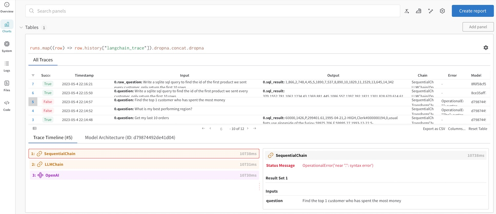

# W&B Prompts Demo - SQL Generation

We will use LLMs to generate SQL with natural language. The development process of LLM apps requires experimentation, for example with chain architecture and prompt engineering. We will use W&B Prompts Tracer to log our experiments and debug errors. After running the code, you should see a screen like this one in your W&B dashboard: 



## Usage

1. Install Requirements

```
pip install -r requirements.txt
```

2. Notebook Config & Execution

In the `demo_flow.ipynb` notebook, set what `DB_TYPE` you'd like to use, either a local sqlite file in the `data` folder, or the default Snowflake database. After running the notebook, you should see a link to your W&B dashboard and be able to analyze and debug your prompt engineering workflow.