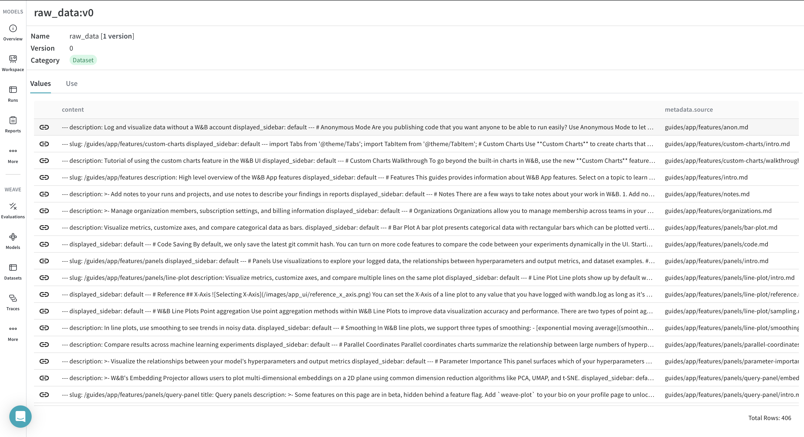
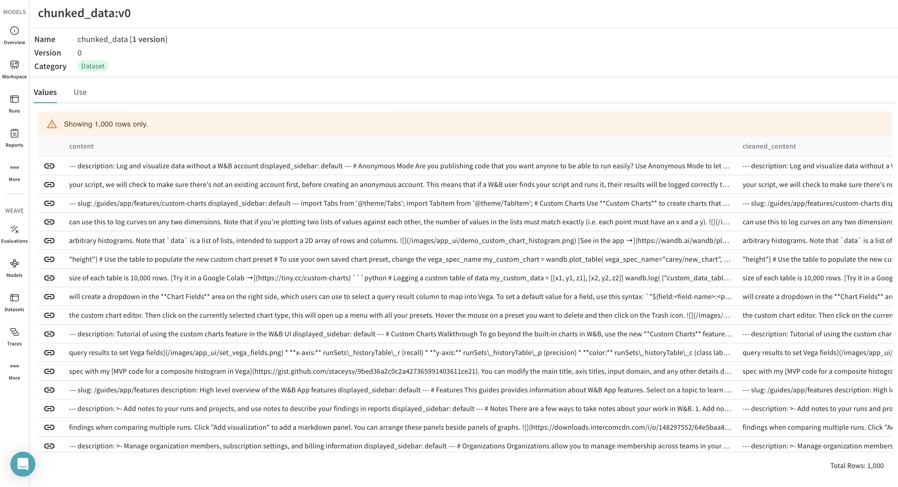
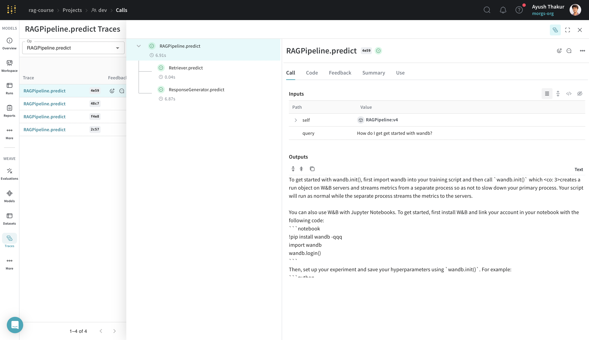
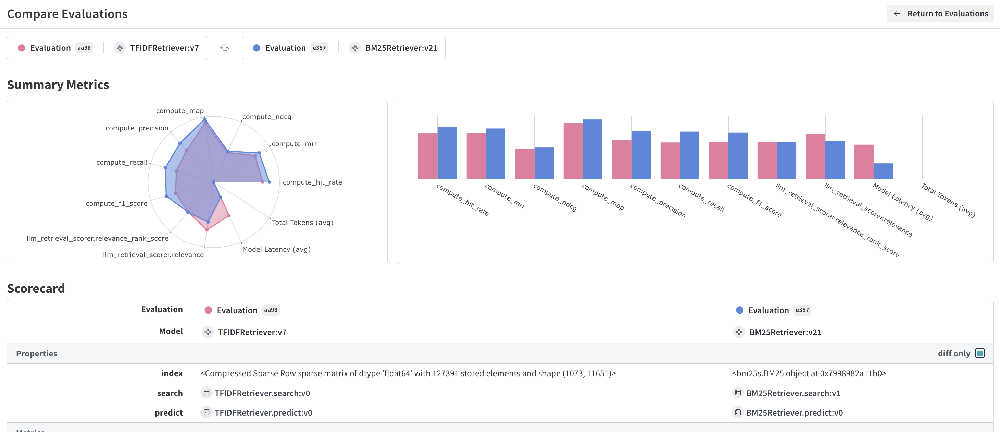
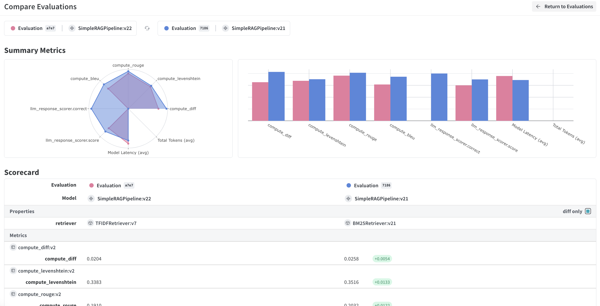
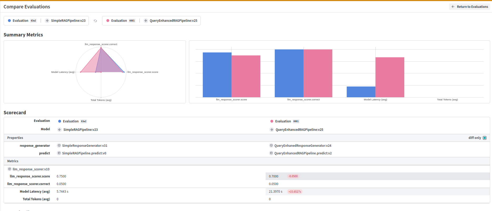
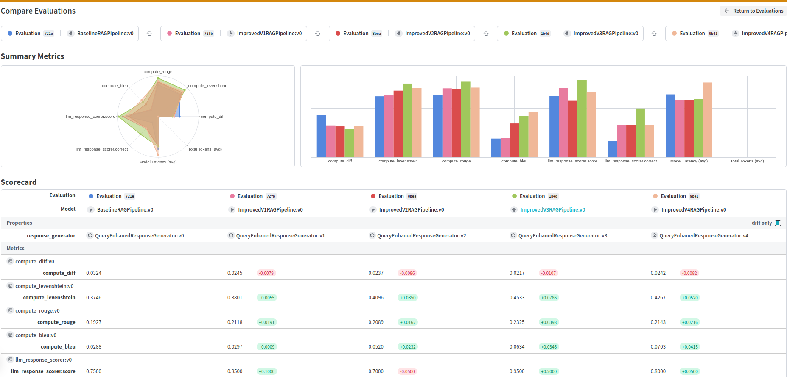

## Chapter 0: Setup

<a target="_blank" href="https://colab.research.google.com/github/wandb/edu/blob/main/rag-advanced/notebooks/Chapter00.ipynb">
  
</a>

<!--- @wandbcode{rag-course-00} -->

Let's install the required packages and check our setup for this course.

### 🎉 Free Cohere API key

Before you run this colab notebook, head over to this [link to redeem a free Cohere API key](https://docs.google.com/forms/d/e/1FAIpQLSc9x4nV8_nSQvJnaINO1j9NIa2IUbAJqrKeSllNNCCbMFmCxw/viewform?usp=sf_link).

Alternatively if you have a Cohere API key feel free to proceed. :)


```
!pip install -qq weave cohere
```

## 1. Setup Weave


The code cell below will prompt you to put in a W&B API key. You can get your API key by heading over to https://wandb.ai/authorize.


```
# import weave
import weave

# initialize weave client
weave_client = weave.init("rag-course")
```

## 2. Setup Cohere

The code cell below will prompt you to put in a Cohere API key.


```
import getpass

import cohere

cohere_client = cohere.ClientV2(
    api_key=getpass.getpass("Please enter your COHERE_API_KEY")
)
```

## A simple-turn chat with Cohere's command-r-plus


```
response = cohere_client.chat(
    messages=[
        {"role": "user", "content": "What is retrieval augmented generation (RAG)?"}
    ],
    model="command-r-plus",
    temperature=0.1,
    max_tokens=2000,
)
```

Let's head over to the weave URL to check out the generated response.

---

# Chapter 1

<a target="_blank" href="https://colab.research.google.com/github/wandb/edu/blob/main/rag-advanced/notebooks/Chapter01.ipynb">
  
</a>

<!--- @wandbcode{rag-course-01} -->

In this chapter, we will learn about building a simple RAG pipeline. We will mainly focus on how to preprocess and chunk the data followed by building a simple retrieval engine without using any fancy "Vector Index". The idea is to show the inner working of a retrieval pipeline and make you understand the workflow from a user query to a generated response using an LLM.

For this chapter you will need a Cohere API key and a W&B account. Run the next cell to pull the github repo and install the dependencies.


```
!git clone https://github.com/wandb/edu.git
%cd edu/rag-advanced
!pip install -qqq -r requirements.txt
%cd notebooks

import nltk

nltk.download("wordnet")
```

Now we are ready to start the chapter.

We will start by logging into W&B and setup the API keys in the environment. You should be able to get your Cohere API key from [here](https://dashboard.cohere.com/api-keys).


```
import getpass
import os

import wandb

os.environ["COHERE_API_KEY"] = getpass.getpass("Please enter your COHERE_API_KEY")
wandb.login()
```


```
import pathlib
from typing import List

import weave

from scripts.utils import display_source
```

Here, we will start a Weights and Biases (W&B) run. We will be using this to download a [W&B Artifact](https://docs.wandb.ai/guides/artifacts) called `wandb_docs`. This is the raw W&B documentation. W&B Artifacts is suited for versiong different data sources which needs preprocessing/cleaning.


```
WANDB_PROJECT = "rag-course"

run = wandb.init(
    project=WANDB_PROJECT,
    group="Chapter 1",
)
```

## Data ingestion

### Loading the data

Use [W&B Artifacts](https://docs.wandb.ai/guides/artifacts) to track and version data as the inputs and outputs of your W&B Runs. For example, a model training run might take in a dataset as input and produce a trained model as output. W&B Artifact is a powerful object storage with rich UI functionalities.

Below we are downloading an artifact named `wandb_docs` which will download 400 odd markdown files in your `../data/wandb_docs` directory. This is will be our data source.


```
documents_artifact = run.use_artifact(
    f"rag-course/dev/wandb_docs:latest", type="dataset"
)
data_dir = "../data/wandb_docs"

docs_dir = documents_artifact.download(data_dir)
```

Let's inspect the `../data/wandb_docs` directory and look at the name first 5 files. We should see that they are all in markdown (`.md`) file format.


```
docs_dir = pathlib.Path(docs_dir)
docs_files = sorted(docs_dir.rglob("*.md"))

print(f"Number of files: {len(docs_files)}\n")
print("First 5 files:\n{files}".format(files="\n".join(map(str, docs_files[:5]))))
```

Lets look at an example file. We can take the first element of the list (`docs_files`) and use the `Path.read_text` method to get the decoded contents of the file as a string.


```
print(docs_files[0].read_text())
```

💡 Looking at the example, we see some structure and format to it.

It is always a good practice to look through few examples to see if there is any pattern to your data source.
It helps to come up with better preprocessing steps and chunking strategies.

Now, let's store our documents as dictionaries with content (raw text) and metadata.

Metadata is extra information for that data point which can be used to group together similar data points, or filter out a few data points.
We will see in future chapters the importance of metadata and why it should not be ignored while building the ingestion pipeline.

The metadata can be derived (`raw_tokens`) or is inherent (`source`) to the data point.

Note that we are simply doing word counting and calling it `raw_tokens`.
In practice we would be using a [tokenizer](https://docs.cohere.com/docs/tokens-and-tokenizers) to calculate the token counts but this naive calculation is an okay approximation for now.


```
# We'll store the files as dictionaries with some content and metadata
data = []
for file in docs_files:
    content = file.read_text()
    data.append(
        {
            "content": content,
            "metadata": {
                "source": str(file.relative_to(docs_dir)),
                "raw_tokens": len(content.split()),
            },
        }
    )
data[:2]
```

Checking the total number of tokens of your data source is a good practice. In this case, the total tokens is more than 200k. Surely, most LLM providers cannot process these many tokens. Building a RAG is justified in such cases.


```
total_tokens = sum(map(lambda x: x["metadata"]["raw_tokens"], data))
print(f"Total Tokens in dataset: {total_tokens}")
```

## W&B Weave

In the previous section we used a W&B Artifact to download the source documents.

We could have used it to log our processed data but instead we will use W&B Weave for the task.

Why?

- W&B Weave is standalone and doesn't need backward compatibility with core W&B offerings.
- W&B Weave is designed for modern LLMOps use case.
- We would like to keep the data, "models" (function, API, collection of parser, extrators, and more) and evaluators in "one single source of truth" managed by W&B Weave.

What?

W&B Weave is a lightweight toolkit for tracking and evaluating LLM applications:

- Log and debug language model inputs, outputs, and traces
- Build rigorous, apples-to-apples evaluations for language model use cases
- Organize all the information generated across the LLM workflow, from experimentation to evaluations to production


The newly created list of dictionaries with `content` and `metadata` will now be logged as a W&B Weave Dataset called `raw_data`. Notice that out processed data is a list of dicts.

Let's initialize W&B Weave. Once intialized, we will start tracking (more on it later) the inputs and the outputs along with underlying attributes (model name, top_k, etc.).


```
WANDB_PROJECT = "rag-course"

weave_client = weave.init(WANDB_PROJECT)
```


```
# build weave dataset
raw_data = weave.Dataset(name="raw_data", rows=data)

# publish the dataset
weave.publish(raw_data)
```



### Chunking the data

Each document contains a large number of tokens, so we need to split it into smaller chunks to manage the number of tokens per chunk. This approach serves three main purposes:

* Most embedding models have a limit of 512 tokens per input (based on their training data and parameters).

* Chunking allows us to retrieve and send only the most relevant portions to our LLM, significantly reducing the total token count. This helps keep the LLM's cost and processing time manageable.

* When the text is small-sized, embedding models tend to generate better vectors as they can capture more fine-grained details and nuances in the text, resulting in more accurate representations.

When choosing chunk size, consider these trade-offs:

- Smaller chunks (100-200 tokens):
  * More precise retrieval
  * Better for finding specific details
  * May lack broader context

- Larger chunks (500-1000 tokens):
  * Provide more context
  * Capture more coherent ideas
  * May introduce noise and reduce precision

The optimal size depends on your data, expected queries, and model capabilities. Experiment with different sizes to find the best balance for your use case.

Here we are chunking each content (text) to a maximum length of 300 tokens (`CHUNK_SIZE`).
For now, we will not be overlapping (`CHUNK_OVERLAP`) the content of one chunk with another chunk.


```
# These are hyperparameters of our ingestion pipeline

CHUNK_SIZE = 300
CHUNK_OVERLAP = 0


def split_into_chunks(
    text: str, chunk_size: int = CHUNK_SIZE, chunk_overlap: int = CHUNK_OVERLAP
) -> List[str]:
    """Function to split the text into chunks of a maximum number of tokens
    ensure that the chunks are of size CHUNK_SIZE and overlap by chunk_overlap tokens
    use the `tokenizer.encode` method to tokenize the text
    """
    tokens = text.split()
    chunks = []
    start = 0
    while start < len(tokens):
        end = start + chunk_size
        chunk = tokens[start:end]
        chunks.append(" ".join(chunk))
        start = end - chunk_overlap
    return chunks
```

We will use the `raw_data` artifact we just published as W&B Weave Dataset as the input to the chunking function.


```
# download the `raw_data` Dataset
raw_data = weave.ref(
    "weave:///rag-course/rag-course/object/raw_data:nuZosGsP58MXKxhluN2hzvKK9XB8xSxlTuOBmEzWzLo"
).get()
# uncomment the next line to get the raw data from weave from your own project instead
# raw_data = weave.ref("raw_data:v0").get()

# this is how we index into the data
print(raw_data.rows[:2])
```

A Weave Dataset is compatible with the rest of the Weave workflow and is pythonic.

Let us chunk each document in the raw data Artifact. We create a new list of dictionaries with the chuked text (`content`) and with `metadata`.


```
chunked_data = []
for doc in raw_data.rows:
    chunks = split_into_chunks(doc["content"])
    for chunk in chunks:
        chunked_data.append(
            {
                "content": chunk,
                "metadata": {
                    "source": doc["metadata"]["source"],
                    "raw_tokens": len(chunk.split()),
                },
            }
        )

print(chunked_data[:2])
```

### Cleaning the data

Cleaning up data is crucial for most ML pipelines and applies to a RAG/Agentic pipeline as well.
Usually, higher quality chunks provided to an LLM generates a higher quality response.

here, it is particularly important for several reasons:

- **Tokenization issues**: Special tokens can interfere with the model's tokenization process, leading to unexpected interpretations of the text.
- **Vocabulary pollution**: Unusual tokens can inflate the model's vocabulary, potentially diluting the importance of meaningful terms.
- **Semantic distortion**: Special characters or formatting tokens (e.g., HTML tags) can alter the semantic meaning of sentences if not properly handled.
- **Consistency**: Removing or standardizing special tokens ensures consistent representation across different data sources.
- **Model efficiency**: Cleaner data often leads to more efficient model training and inference, as the model doesn't need to process irrelevant tokens.

By cleaning the data, we ensure that our model focuses on the meaningful content rather than artifacts or noise in the text.

We will use a simple function `make_text_tokenization_safe` to remove special tokens from the text.
This is a good practice as most LLM providers do not like special tokens in the text.


```
from scripts.preprocess import make_text_tokenization_safe

display_source(make_text_tokenization_safe)
```


```
cleaned_data = []
for doc in chunked_data:
    cleaned_doc = doc.copy()
    cleaned_doc["cleaned_content"] = make_text_tokenization_safe(doc["content"])
    cleaned_doc["metadata"]["cleaned_tokens"] = len(
        cleaned_doc["cleaned_content"].split()
    )
    cleaned_data.append(cleaned_doc)
print(cleaned_data[:2])
```

Again we will store the cleaned data as a Weave Dataset named `chunked_data`.


```
dataset = weave.Dataset(name="chunked_data", rows=cleaned_data)
weave.publish(dataset)
```



## Vectorizing the data

One of the key ingredient of most retrieval systems is to represent the given modality (text in our case) as a vector.

This vector is a numerical representation representing the "content" of that modality (text).

Text vectorization (text to vector) can be done using various techniques like [bag-of-words](https://en.wikipedia.org/wiki/Bag-of-words_model), [TF-IDF](https://en.wikipedia.org/wiki/Tf–idf) (Term Frequency-Inverse Document Frequency), and embeddings like [Word2Vec](https://en.wikipedia.org/wiki/Word2vec), [GloVe](https://nlp.stanford.edu/projects/glove/), and transformer based architectures like BERT and more, which capture the semantic meaning and relationships between words or sentences.


In this chapter, we'll use TF-IDF (Term Frequency-Inverse Document Frequency) for vectorizing our contents. Here's why:

- **Simplicity**: TF-IDF is straightforward to implement and understand, making it an excellent starting point for RAG systems.
- **Efficiency**: It's computationally lightweight, allowing for quick processing of large document collections.
- **No training required**: Unlike embedding models, TF-IDF doesn't need pre-training, making it easy to get started quickly.
- **Interpretability**: The resulting vectors are directly related to word frequencies, making them easy to interpret.

While more advanced methods like embeddings often provide better performance, especially for semantic understanding, we'll explore these in later chapters as we progress through the course.

Let's download the `cleaned_data` artifact and use it to generate vectors for our chunks.


```
chunked_data = weave.ref(
    "weave:///rag-course/rag-course/object/chunked_data:Lt6M8qCUICD1JZTlMYzuDLTVtvFYESxvj3tcAIoPrtE"
).get()
# uncomment the next line to get the chunked data from weave from your own project instead
# chunked_data = weave.ref("chunked_data:v0").get()
print(chunked_data.rows[:2])
```

Next, we will create a simple `Retriever` class. This class is responsible for vectorizing the chunks using the `index_data` method and provides a convenient method `search`, for querying the vector index using cosine distance similarity.

- `index_data` will take a list of chunks and vectorize it using TF-IDF and store it as `index`.

- `search` will take a `query` (question) and vectorize it using the same technique (TF-IDF in our case). It then computes the cosine distance between the query vector and the index (list of vectors) and pick the top `k` vectors from the index. These top `k` vectors represent the chunks that are closest (most relevant) to the `query`.

---

Note that the `Retriever` class is inherited from `weave.Model`.

A Model is a combination of data (which can include configuration, trained model weights, or other information) and code that defines how the model operates. By structuring your code to be compatible with this API, you benefit from a structured way to version your application so you can more systematically keep track of your experiments.

To create a model in Weave, you need the following:

- a class that inherits from weave.Model
- type definitions on all attributes
- a typed `predict`, `infer` or `forward` method with `@weave.op()` decorator.

Imagine `weave.op()` to be a drop in replacement for `print` or logging statement.
However, it does a lot more than just printing and logging by tracking the inputs and outputs of the function and storing them as Weave objects. In addition to state tracking you also get a nice weave UI to inspect the inputs, outputs, and other metadata.

If you have not initialized a weave run by doing `weave.init`, the code will work as it is without any tracking.

The `predict` method decorated with `weave.op()` will track the model settings along with the inputs and outputs anytime you call it.


```
from scripts.retriever import TFIDFRetriever

display_source(TFIDFRetriever)
```

This simple TF-IDF based retriever serves as a good starting point, but for more complex applications, it can be extended or improved in several ways:

- **Semantic search**: Implement embedding-based retrieval using dense vectors for better semantic understanding.
- **Hybrid retrieval**: Combine TF-IDF with embedding-based methods to balance lexical and semantic matching.
- **Query expansion**: Incorporate techniques like automatic query expansion to improve recall.
- **Document ranking**: Implement more sophisticated ranking algorithms, such as BM25 and re-ranking models.
- **Scalability**: For larger datasets, consider using approximate nearest neighbor search techniques or vector databases.

As we progress through the course, we'll explore some of these concepts and gradually enhance our retriever to make it more robust and efficient for real-world applications.

Now, let's see our `TFIDFRetriever` in action. We will index our chunked data and then query the retriever to fetch related chunks from the index.


```
retriever = TFIDFRetriever()
retriever.index_data(list(map(dict, chunked_data.rows)))
```


```
query = "How do I use W&B to log metrics in my training script?"
search_results = retriever.search(query)
for result in search_results:
    print(result)
```

## Generating a response

There are two components of any RAG pipeline - a `Retriever` and a `ResponseGenerator`. Earlier, we designed a simple retriever. Here we are designing a simple `ResponseGenerator`.

The `generate_response` method takes the user question along with the retrieved context (chunks) as inputs and makes a LLM call using the `model` and `prompt` (system prompt). This way the generated answer is grounded on the documentation (our usecase). In this course we are using Cohere's `command-r` model.

As earlier, we have wrapped this `ResponseGenerator` class with weave for tracking the inputs and the output.


```
from scripts.response_generator import SimpleResponseGenerator

display_source(SimpleResponseGenerator)
```

Below is the system prompt. Consider this to be set of instructions on what to do with the user question and the retrieved contexts. In practice, the system prompt can be very detailed and involved (depending on the usecase) but we are showing a simple prompt. Later we will iterate on it and show how improving the system prompt improves the quality of the generated response.


```
INITIAL_PROMPT = open("prompts/initial_system.txt", "r").read()
print(INITIAL_PROMPT)
```

Let's generate the response for the question "How do I use W&B to log metrics in my training script?". We have already retrieved the context in the previous section and passing both the question and the context to the `generate_response` method.


```
response_generator = SimpleResponseGenerator(model="command-r", prompt=INITIAL_PROMPT)
answer = response_generator.generate_response(query, search_results)
print(answer)
```

## Simple Retrieval Augmented Generation (RAG) Pipeline

Finally, we will bring everything together. As stated earlier, a RAG pipeline primarily consists of a retriever and a response generator.

We define a class `SimpleRAGPipeline` which combines the steps of retrieval and response generation.

We'll define a `predict` method that takes the user query, retrieves relevant context using the retriever and finally synthesizes a response using the response generator.

We'll also define a few convinence methods to format the documents retrieved from the retriever and create a system prompt for the response generator.


```
from scripts.rag_pipeline import SimpleRAGPipeline

display_source(SimpleRAGPipeline)
```

Let us initialize the `RAGPipeline`.


```
# Initialize the response generator
response_generator = SimpleResponseGenerator(model="command-r", prompt=INITIAL_PROMPT)

# Bring them together as a RAG pipeline
rag_pipeline = SimpleRAGPipeline(
    retriever=retriever, response_generator=response_generator, top_k=5
)
```


```
response = rag_pipeline.predict("How do I get get started with wandb?")
print(response, sep="\n")
```

Click on the link starting with a 🍩. This is the trace timeline for all the executions that happened in our simple RAG application. Go to the link and drill down to find everything that got tracked.



## Key Takeaways

In this chapter, we've built a simple RAG pipeline from scratch. Here's what we've learned:

- **Data Processing**: How to ingest, chunk, and clean data using W&B Artifacts and Weave
- **Retrieval**: Implementing a basic TF-IDF based retriever
- **Response Generation**: Using Cohere's API and `command-r` model to generate responses based on retrieved context
- **RAG Pipeline**: Combining retrieval and generation into a cohesive system
- **Logging and Tracking**: Utilizing W&B Weave for efficient experiment tracking

---

# Chapter 2:

<a target="_blank" href="https://colab.research.google.com/github/wandb/edu/blob/main/rag-advanced/notebooks/Chapter02.ipynb">
  
</a>

<!--- @wandbcode{rag-course-02} -->

**Comprehensive Evaluation Strategies**

In this chapter, we will evaluate the two main components of a RAG pipeline - retriever and response generator.

Evaluating the retriever can be considered component evaluation. Depending on your RAG pipeline, there can be a few components and for ensuring robustness of your system, it is recommended to come up with evaluation for each components.

We start off by setting up the required packages.


```
# @title Setup
!git clone https://github.com/wandb/edu.git
%cd edu/rag-advanced
!pip install -qqq -r requirements.txt
%cd notebooks

import nltk

nltk.download("wordnet")
```


```
import getpass
import os

os.environ["COHERE_API_KEY"] = getpass.getpass("Please enter your COHERE_API_KEY")
```


```
import asyncio

import nest_asyncio

nest_asyncio.apply()

import weave

from scripts.utils import display_source
```

In this chapter we will also use W&B Weave for our evaluation purposes. The `weave.Evaluation` class is a light weight class that can be used to evaluate the performance of a `weave.Model` on a `weave.Dataset`. We will go into more details.

We first initialize a weave client which can track both the traces and the evaluation scores.


```
WANDB_PROJECT = "rag-course"

weave_client = weave.init(WANDB_PROJECT)
```

## Collecting data for evaluation

We are using a subset of the evaluation dataset we had created for wandbot.

Learn more about how we created the evaluation dataset here:

- [How to Evaluate an LLM, Part 1: Building an Evaluation Dataset for our LLM System](https://wandb.ai/wandbot/wandbot-eval/reports/How-to-Evaluate-an-LLM-Part-1-Building-an-Evaluation-Dataset-for-our-LLM-System--Vmlldzo1NTAwNTcy)
- [How to Evaluate an LLM, Part 2: Manual Evaluation of Wandbot, our LLM-Powered Docs Assistant](https://wandb.ai/wandbot/wandbot-eval/reports/How-to-Evaluate-an-LLM-Part-2-Manual-Evaluation-of-Wandbot-our-LLM-Powered-Docs-Assistant--Vmlldzo1NzU4NTM3)

The main take away from these reports are:

- we first deployed wandbot for internal usage based on rigorous eyeballing based evalution.
- the user query distribution was throughly analyized and clustered. we samples a good representative queries from these clusters and created a gold standard set of queries.
- we then used in-house MLEs to perform manual evaluation using Argilla. Creating such evaluation platforms are easy.
- To summarize, speed is the key here. Use whatever means you have to create a meaningful eval set.

The evaluation samples are logged as [`weave.Dataset`](https://wandb.github.io/weave/guides/core-types/datasets/). `weave.Dataset` enable you to collect examples for evaluation and automatically track versions for accurate comparisons.

Below we will download the latest version locally with a simple API.


```
# Easy eval dataset with 20 samples.
eval_dataset = weave.ref(
    "weave:///rag-course/dev/object/Dataset:Qj4IFICc2EbdXu5A5UuhkPiWgxM1GvJMIvXEyv1DYnM"
).get()

print("Number of evaluation samples: ", len(eval_dataset.rows))
```

Iterating through each sample is easy.

We have the question, ground truth answer and ground truth contexts.


```
dict(eval_dataset.rows[0])
```

## Evaluating the Retriever

The fundamental idea of evaluating a retriever is to check how well the retrieved content matches the expected contents. For evaluating a RAG pipeline end to end, we need query and ground truth answer pairs. The ground truth answer must be grounded on some "ground" truth chunks. This is a search problem, it's easiest to start with tradiaional Information retrieval metrics.

You might already have access to such evaluation dataset depending on the nature of your application or you can synthetically build one. To build one you can retrieve random documents/chunks and ask an LLM to generate query-answer pairs - the underlying documents/chunks will act as your ground truth chunk.

In the sections below, we will look at different metrics that can be used to evaluate the retriever we built in the last chapter.

First let us download the chunked data (from chapter 1) and index it using a simple TFIDF based retriever.


```
# Reload the data from Chapter 1
chunked_data = weave.ref(
    "weave:///rag-course/rag-course/object/chunked_data:Lt6M8qCUICD1JZTlMYzuDLTVtvFYESxvj3tcAIoPrtE"
).get()
# uncomment the next line to get the chunked data from weave from your own project instead
# chunked_data = weave.ref("chunked_data:v0").get()
print("Number of chunked data: ", len(chunked_data.rows))
chunked_data.rows[:2]
```

We will import the `TFIDFRetriever` which is an instance of `weave.Model` and index the chunked data from the last chapter.


```
from scripts.retriever import TFIDFRetriever

display_source(TFIDFRetriever)

retriever = TFIDFRetriever()
retriever.index_data(list(map(dict, chunked_data.rows)))
```

## Metrics to evaluate retriever

We can evaluate a retriever using traditional ML metrics. We can also evaluate by using a powerful LLM (next section).

Below we are importing both traditional metrics and LLM as a judge metric from the `scripts/retrieval_metrics.py` file.


```
from scripts.retrieval_metrics import IR_METRICS
from scripts.utils import display_source
```

Let us first understand the basic traditional metrics we will be using. Each metric expects a `model_output` which is a list of retrieved chunks from the retriever and `contexts` which is a list of ground truth contexts.


```
for scorer in IR_METRICS:
    display_source(scorer)
```

#### Evaluating retrieval on other metrics


```
retrieval_evaluation = weave.Evaluation(
    name="Retrieval_Evaluation",
    dataset=eval_dataset,
    scorers=IR_METRICS,
    preprocess_model_input=lambda x: {"query": x["question"], "k": 5},
)

retrieval_scores = asyncio.run(retrieval_evaluation.evaluate(retriever))
```

### Using an LLM evaluator for evaluating retriever

**ref: https://arxiv.org/pdf/2406.06519**

How do we evaluate if we don't have any ground truth?

We can use a powerful LLM as a judge to evaluate the retriever.


```
from scripts.retrieval_metrics import LLM_METRICS

for metric in LLM_METRICS:
    display_source(metric)
```


```
retrieval_evaluation = weave.Evaluation(
    name="LLM_Judge_Retrieval_Evaluation",
    dataset=eval_dataset,
    scorers=LLM_METRICS,
    preprocess_model_input=lambda x: {"query": x["question"], "k": 5},
)
retrieval_scores = asyncio.run(retrieval_evaluation.evaluate(retriever))
```

## Evaluating the Response


```
from scripts.rag_pipeline import SimpleRAGPipeline
from scripts.response_generator import SimpleResponseGenerator

INITIAL_PROMPT = open("prompts/initial_system.txt", "r").read()
response_generator = SimpleResponseGenerator(model="command-r", prompt=INITIAL_PROMPT)
rag_pipeline = SimpleRAGPipeline(
    retriever=retriever, response_generator=response_generator, top_k=5
)
```


```
from scripts.response_metrics import NLP_METRICS

for scorer in NLP_METRICS:
    display_source(scorer)
```


```
response_evaluations = weave.Evaluation(
    name="Response_Evaluation",
    dataset=eval_dataset,
    scorers=NLP_METRICS[:-1],
    preprocess_model_input=lambda x: {"query": x["question"]},
)

response_scores = asyncio.run(response_evaluations.evaluate(rag_pipeline))
```

### Using an LLM as a Response Judge

Some metrics cannot be defined objectively and are particularly useful for more subjective or complex criteria.
We care about correctness, faithfulness, and relevance.

- **Answer Correctness** - Is the generated answer correct compared to the reference and thoroughly answers the user's query?
- **Answer Relevancy** - Is the generated answer relevant and comprehensive?
- **Answer Factfulness** - Is the generated answer factually consistent with the context document?


```
from scripts.response_metrics import LLM_METRICS

for metric in LLM_METRICS:
    display_source(metric)
```


```
correctness_evaluations = weave.Evaluation(
    name="Correctness_Evaluation",
    dataset=eval_dataset,
    scorers=LLM_METRICS,
    preprocess_model_input=lambda x: {"query": x["question"]},
)

response_scores = asyncio.run(correctness_evaluations.evaluate(rag_pipeline))
```

## Exercise

1. Implement the `Relevance` and `Faithfulness` evaluators and evaluate the pipeline on all the dimensions.
2. Generate and share a W&B report with the following sections in the form of tables and charts:
    
    - Summary of the evaluation
    - Retreival Evaluations
        - IR Metrics
        - LLM As a Retrieval Judge Metric
    - Response Evalations
        - Traditional NLP Metrics
        - LLM Judgement Metrics
    - Overall Evalations
    - Conclusion

---

# Chapter 3 

<a target="_blank" href="https://colab.research.google.com/github/wandb/edu/blob/main/rag-advanced/notebooks/Chapter03.ipynb">
  
</a>

<!--- @wandbcode{rag-course-03} -->

## Data Ingestion and Preprocessing

At its core, RAG (Retrieval-Augmented Generation) is a method for integrating private data with pre-trained, instruction-tuned language models. The effectiveness of your RAG system is directly proportional to the quality of your data ingestion pipeline.

Data ingestion encompasses both data sources and preprocessing. As with most machine learning systems, the principle of "garbage in, garbage out" applies to LLMs. Therefore, optimizing your data ingestion pipeline is crucial for RAG efficacy.

Key considerations for efficient data ingestion:
1. Periodic updates: Implement a system that can seamlessly update when data sources change.
2. Quality control: Ensure data cleanliness and relevance.
3. Scalability: Design the pipeline to handle increasing data volumes.


**Tip**: When building your data ingestion pipeline, start with a small, representative sample of your data. This allows you to quickly iterate on your preprocessing steps and catch potential issues early. Focus on creating an end-to-end working system before optimizing specific components like chunk size, parsing strategies, or data formats (e.g., markdown, HTML, plain text).


To begin, execute the following cell to clone the repository and install dependencies:


```python
!git clone https://github.com/wandb/edu.git
%cd edu/rag-advanced
!pip install -qqq -r requirements.txt
%cd notebooks

import nltk

nltk.download("wordnet")
nltk.download("punkt")
```

With the setup complete, we can now proceed with the chapter content.

Initial steps:
1. Log in to Weights & Biases (W&B)
2. Configure environment variables for API access

To obtain your Cohere API key, visit the [Cohere API dashboard](https://dashboard.cohere.com/api-keys).


```python
import getpass
import os

os.environ["COHERE_API_KEY"] = getpass.getpass("Please enter your COHERE_API_KEY")
```


```python
import asyncio

import nest_asyncio

nest_asyncio.apply()
import numpy as np
import weave

from scripts.utils import display_source
```


```python
WANDB_PROJECT = "rag-course"

weave_client = weave.init(WANDB_PROJECT)
```

**Best Practice**: Document your data preprocessing steps meticulously. This not only helps with reproducibility but also makes it easier to debug issues and optimize your pipeline later.

## Data Preparation

We'll begin our journey with raw data processing. 

Our first step is to retrieve the most recent `raw_data` we logged into weave. We had logged this in Chapter 1 and we will use the same dataset as our starting point.


```python
# download the `raw_data` Dataset from chapter 1
raw_data = weave.ref(
    "weave:///rag-course/rag-course/object/raw_data:nuZosGsP58MXKxhluN2hzvKK9XB8xSxlTuOBmEzWzLo"
).get()
# uncomment the next line to get the raw data from weave from your own project instead
# raw_data = weave.ref("raw_data:v0").get()

# this is how we index into the data
print(raw_data.rows[:2])
raw_data = list(map(dict, raw_data.rows[:]))
```

In chapter 1, we naively counted each word (as they appear in English text) as one token (`raw_tokens`). Now let's update to using the correct token counting strategy (`tokens`).


We will use [Cohere's tokenizer](https://docs.cohere.com/docs/tokens-and-tokenizers) to calculate the accurate number of tokens per document in our `raw_data`. Both the correct token count and word count will be stored as metadata for each document.


In RAG systems, accurate tokenization is crucial for proper text processing and context management. Let's examine two key functions: `tokenize_text` and `length_function`.

**The `tokenize_text` Function**: This function tokenizes input text using Cohere's tokenization API. Here's how it works:

1. It initializes a Cohere client using an API key stored in environment variables.
2. It calls the `tokenize` method of the Cohere client, passing:
   - The input `text`
   - The specified `model` (defaulting to "command-r")
   - `offline=True` to use a locally cached tokenizer for efficiency

The function returns a list of tokens, which are subword units that the model uses to process text.

**The `length_function`**: This function calculates the number of tokens in a given text. It operates as follows:

1. It calls `tokenize_text` to convert the input `text` into tokens.
2. It returns the length of the resulting token list.

Understanding the token count is essential because:
- It helps determine if a text fits within a model's context window.
- It allows for more accurate text chunking and processing in the RAG pipeline.
- It provides a basis for estimating computational costs, as many API pricing models are based on token count.

By using these functions, we ensure consistent and accurate tokenization throughout our RAG system, which is critical for retrieval accuracy and overall performance.


```python
from scripts.utils import (TOKENIZERS, get_special_tokens_set, length_function,
                           tokenize_text)

# this is the function that will tokenize the text
display_source(tokenize_text)
# this is the function that calculates the number of tokens
display_source(length_function)
```


```python
for doc in raw_data[:]:
    doc["metadata"]["words"] = doc["metadata"].pop("raw_tokens")
    doc["metadata"]["tokens"] = length_function(doc["content"])
raw_data[:2]
```

As you can see above, the `words` count (used in Chapter 1) is quite different from the actual `tokens` count. This discrepancy highlights the importance of accurate token counting in RAG systems. Knowing the correct number of tokens is crucial for several reasons:

1. It helps decide whether to build a RAG pipeline or ingest the whole document into an LLM, especially now that many top LLMs support long context windows.
2. It informs the optimal chunk size for efficient processing.
3. It ensures efficient use of context windows and helps manage costs associated with token-based API calls.
4. It aids in predicting and controlling response generation length, which is vital for maintaining coherent and relevant outputs.

By accurately counting tokens, we can make informed decisions about our RAG system's architecture and optimize its performance and cost-effectiveness.

**Tip**: Different tokenizers may produce slightly different results. Always use the same tokenizer that your target LLM uses to ensure consistency between preprocessing and model input.

## Pre-processing

Now that we have our raw data prepared and correctly tokenized, the next crucial step is to pre-process this data. Pre-processing is essential for removing extraneous information and formatting that could interfere with our language model's understanding of the content.

In this section, we'll focus on cleaning our data by removing markdown elements, special characters, and extra whitespace. This process will help streamline our text for more effective tokenization and ultimately improve the performance of our RAG system.


Raw data often contains extra formatting information (like markdown elements) that, while useful for human readers, is not beneficial for LLMs. Removing these elements, along with special characters and extra whitespace, is essential in RAG preprocessing for several reasons:

1. It eliminates noise and irrelevant information that could confuse the LLM.
2. It ensures the model focuses solely on the content's semantic meaning.
3. It standardizes input across various document types, creating a consistent format for the LLM.
4. It can improve retrieval accuracy and response generation quality.

To achieve this, we use two key functions:

1. `convert_contents_to_text`: This function converts raw markdown to HTML, then uses BeautifulSoup to remove image links, images, and other formatting information.
2. `make_text_tokenization_safe`: This function removes any special tokens present in the text. Special characters here are those defined in the tokenizer and may vary depending on the model used.

By applying these preprocessing steps, we create clean, standardized input that's optimized for our LLM pipeline.

**Best Practice**: When cleaning text data, be cautious about removing too much information. While it's important to remove noise, overzealous cleaning might inadvertently remove context that could be valuable for the LLM.


```python
from scripts.preprocess import (convert_contents_to_text,
                                make_text_tokenization_safe)

# this is the function that converts the markdown to html
display_source(convert_contents_to_text)
# this is the function that cleans the text
display_source(make_text_tokenization_safe)
```

We are converting the raw markdown documents to text and making them tokenization-safe. This process involves removing special tokens that could interfere with the tokenization process. Let's examine the first 5 special tokens to understand what's being removed.

After processing, you'll notice that the `parsed_tokens` count is smaller compared to the original `tokens` count. This reduction is expected and indicates that we've successfully removed extraneous formatting and special characters, resulting in a cleaner text representation that's more suitable for our LLM pipeline.

This step is crucial for ensuring that our input data is optimized for tokenization and subsequent processing by the language model.


```python
special_tokens_set = get_special_tokens_set(TOKENIZERS["command-r"])
print(list(special_tokens_set)[:5])

parsed_data = []

for doc in raw_data:
    parsed_doc = doc.copy()
    content = convert_contents_to_text(doc["content"])
    parsed_doc["parsed_content"] = make_text_tokenization_safe(
        content, special_tokens_set=special_tokens_set
    )
    parsed_doc["metadata"]["parsed_tokens"] = length_function(
        parsed_doc["parsed_content"]
    )
    parsed_data.append(parsed_doc)
parsed_data[:2]
```

Again, we can store the parsed data as a weave Dataset


```python
# build weave dataset
parsed_data = weave.Dataset(name="parsed_data", rows=parsed_data)

# publish the dataset
weave.publish(parsed_data)
```

## Data Chunking

With our data cleaned and pre-processed, we're ready to move on to the next critical step: chunking. Chunking involves breaking down our processed documents into smaller, manageable pieces. This step is crucial for several reasons:

1. It allows us to retrieve more relevant information
2. It helps manage token limits in language models
3. It can improve the overall efficiency of our RAG system

In this section, we'll explore different chunking strategies and implement a semantic chunking approach, which aims to preserve the context and meaning of our text while splitting it into appropriate segments.

We can split the processed data into smaller chunks. This approach serves two purposes:
1. Reduce input token cost by sending only the required data for generation.
2. Limit context to ensure the LLM focuses on relevant details.

While sending the entire document to the LLM is possible, it depends on the total token count and the nature of your use case. This approach can be costlier but is a good starting point.

### Semantic Chunking

Various chunking strategies exist, such as splitting after n words/tokens or on headers. It's advisable to experiment with these simple strategies before moving to more sophisticated ones.

Below, we implement semantic chunking, a sophisticated strategy that has proven effective in practice. This method groups similar sentences into chunks:

1. Split the text into sentences using the [BlingFire](https://github.com/microsoft/BlingFire) library.
2. Group and combine chunks based on semantic similarity.


Semantic chunking offers key advantages over simpler methods like fixed-length splitting:

1. **Improved Relevance**: Groups related sentences, increasing the likelihood of retrieving complete, relevant information.
2. **Context Preservation**: Maintains logical flow within chunks, crucial for accurate LLM understanding and generation.
3. **Adaptive Segmentation**: Creates variable-length chunks that better represent the text's natural structure and content organization.

By keeping related information together, semantic chunking optimizes retrieval accuracy and enhances the RAG system's ability to provide contextually appropriate responses.

For more information on the chunking strategy used, refer to this [research article on evaluating chunking](https://research.trychroma.com/evaluating-chunking).


```python
# download the `parsed_data` Dataset
parsed_data = weave.ref(
    "weave:///rag-course/rag-course/object/parsed_data:UhWHAwXzvIcYaZ3X1x4eX2KDyYhCM4TPSsj8Oq8dLq4"
).get()
# uncomment the next line to get the parsed data from weave from your own project instead
# parsed_data = weave.ref("parsed_data:v0").get()

# this is how we index into the data
print(parsed_data.rows[:2])

parsed_data = list(map(dict, parsed_data.rows[:]))
parsed_data[:2]
```


```python
from scripts.chunking import chunk_documents

# this is the function that chunks the documents
display_source(chunk_documents)
```

Since we are doing semantic chunking, the chunking process can take a while. For now, let's just take the first 5 documents and chunk them.


```python
sample_chunked_data = chunk_documents(parsed_data[:5])
sample_chunked_data[:2]
```

For the rest of the data, we'll retrieve the chunked data from weave.


```python
# fetch the chunked data
chunked_data = weave.ref(
    "weave:///rag-course/rag-course/object/chunked_data:Ij9KThmiZQ9ljpCm8rVXTJlCaAbY2qC0zX6UJkBWHQ0"
).get()
# uncomment the next line to get the chunked data from weave from your own project instead
# chunked_data = weave.ref("chunked_data:latest").get()

# this is how we index into the data
print(chunked_data.rows[:2])

chunked_data = list(map(dict, chunked_data.rows[:]))
```


```python
mean_chunk_size = np.mean([doc["metadata"]["parsed_tokens"] for doc in chunked_data])
std_chunk_size = np.std([doc["metadata"]["parsed_tokens"] for doc in chunked_data])
print(f"Mean chunk size: {mean_chunk_size}, Std chunk size: {std_chunk_size}")
```


```python
# if you run your own chunking method, you can publish the chunked data in a weave Dataset
# # Again, we'll store the chunked data in a weave Dataset
# chunked_data = weave.Dataset(name="chunked_data", rows=chunked_data)

# # publish the dataset
# weave.publish(chunked_data)
```

**Tip**: Experiment with different chunking strategies and sizes. The optimal approach often depends on your specific use case and the nature of your documents. Monitor how changes in chunking affect both retrieval accuracy and LLM performance.

## Exploring Alternative Retrieval Methods

Now that we have our data prepared, pre-processed, and chunked, it's time to focus on how we retrieve this information. While we've previously used TF-IDF as our baseline retrieval method, it's important to explore alternatives that might offer improved performance.

In this section, we'll introduce the BM25 (Best Matching 25) retriever, a more sophisticated approach to information retrieval. BM25 is an evolution of TF-IDF that addresses some of its limitations. While TF-IDF simply weighs term frequency against document frequency, BM25 incorporates document length normalization and term frequency saturation. This means BM25 can better handle varying document lengths and prevents common terms from dominating the relevance score. As a result, BM25 often provides more nuanced rankings, especially for longer documents or queries with multiple terms.

By comparing the performance of BM25 against our existing TF-IDF retriever, we can gain valuable insights into:

1. The strengths and weaknesses of different retrieval algorithms in our specific use case
2. The impact of more sophisticated ranking functions on RAG performance
3. Potential areas for further optimization in our retrieval pipeline

In our RAG pipeline, this could lead to more contextually relevant retrievals, potentially improving the quality of the generated responses. Let's implement the BM25 retriever and set up a comparative analysis with our TF-IDF baseline:


```python
from scripts.rag_pipeline import SimpleRAGPipeline
from scripts.response_generator import SimpleResponseGenerator
from scripts.retriever import BM25Retriever, TFIDFRetriever

display_source(BM25Retriever)
```


```python
bm25_retriever = BM25Retriever()
bm25_retriever.index_data(chunked_data)

tfidf_retriever = TFIDFRetriever()
tfidf_retriever.index_data(chunked_data)
```

The rest of the RAG pipeline remains unchanged. We'll use the same response generator and overall structure as before, allowing us to isolate the impact of our new retrieval method. This approach ensures a fair comparison between the TF-IDF and BM25 retrievers within our existing framework.


```python
INITIAL_PROMPT = open("prompts/initial_system.txt", "r").read()
response_generator = SimpleResponseGenerator(model="command-r", prompt=INITIAL_PROMPT)
bm25_rag_pipeline = SimpleRAGPipeline(
    retriever=bm25_retriever, response_generator=response_generator, top_k=5
)
tfidf_rag_pipeline = SimpleRAGPipeline(
    retriever=tfidf_retriever, response_generator=response_generator, top_k=5
)
```

## Evaluate and compare the changes

With our new retrieval method implemented, it's crucial to evaluate its performance and compare it to our baseline. This evaluation will help us understand the impact of our changes and determine whether the BM25 retriever offers improvements over the TF-IDF method.

In this section, we'll use the evaluation dataset and metrics from Chapter 2 to assess both the retrieval performance and the overall RAG pipeline performance with each retriever. This comprehensive evaluation will provide valuable insights into the effectiveness of our improvements.


We are primarily interested in two aspects:
1. The impact of pre-processing on retrieval metrics
2. The effect of different retrieval methods on response metrics

To address these points, we will evaluate:
1. Retrieval metrics for both TF-IDF and BM25 retrievers
2. Response metrics for the RAG pipeline using both retrievers

This comprehensive evaluation will provide insights into the performance of individual retrieval methods and the overall RAG pipeline.

We'll begin by fetching the evaluation dataset and metrics used in Chapter 2. Using Weave, we'll retrieve the dataset and metrics, then run the evaluation using [Weave Evaluations](https://weave-docs.wandb.ai/guides/core-types/evaluations/).


```python
from scripts.response_metrics import ALL_METRICS as RESPONSE_METRICS
from scripts.retrieval_metrics import ALL_METRICS as RETRIEVAL_METRICS
```


```python
eval_dataset = weave.ref(
    "weave:///rag-course/dev/object/Dataset:Qj4IFICc2EbdXu5A5UuhkPiWgxM1GvJMIvXEyv1DYnM"
).get()

print("Number of evaluation samples: ", len(eval_dataset.rows))
```


```python
retrieval_evaluation = weave.Evaluation(
    name="Retrieval_Evaluation",
    dataset=eval_dataset,
    scorers=RETRIEVAL_METRICS,
    preprocess_model_input=lambda x: {"query": x["question"], "k": 5},
)
bm25_retrieval_scores = asyncio.run(retrieval_evaluation.evaluate(bm25_retriever))
tfidf_retrieval_scores = asyncio.run(retrieval_evaluation.evaluate(tfidf_retriever))
```



BM25 outperforms TFIDF in most relevance metrics:
- Higher MAP, NDCG, and MRR indicate better ranking and relevance.
- Improved precision and recall suggest a better balance in retrieving relevant documents.
- Slightly better hit rate.

TFIDF advantages:
- Significantly lower latency, beneficial for time-sensitive applications.

Trade-offs:
- BM25 offers superior retrieval performance at the cost of higher latency.
- TFIDF is faster but generally less accurate in retrieval.


```python
response_evaluations = weave.Evaluation(
    name="Response_Evaluation",
    dataset=eval_dataset,
    scorers=RESPONSE_METRICS,
    preprocess_model_input=lambda x: {"query": x["question"]},
)
bm25_response_scores = asyncio.run(response_evaluations.evaluate(bm25_rag_pipeline))
tfidf_response_scores = asyncio.run(response_evaluations.evaluate(tfidf_rag_pipeline))
```



Again BM25 retriever outperforms TFIDF across most response metrics (ROUGE, BLEU, Correctness, Response Score), leading to more relevant and accurate responses.

- Slightly better ROUGE and BLEU scores indicate more overlap with reference responses.
- Higher LLM Response Scorer results suggest more accurate and coherent responses.
- Marginally higher Levenshtein and diff scores show slight differences from reference responses.

TFIDF advantages:
  - Lower latency, making it more efficient for quicker response generation.

Trade-offs:
  - BM25 offers superior response quality at the cost of higher latency.
  - TFIDF is faster but generally produces less accurate results.

Choose based on your priority: response quality (BM25) or speed (TFIDF).

# Key Takeaways

1. Data Quality is Crucial: The effectiveness of a RAG system heavily depends on the quality of data ingestion and preprocessing. "Garbage in, garbage out" applies to LLMs as well.

2. Accurate Tokenization: Using the correct tokenization strategy is essential for proper text processing and context management. The actual token count often differs significantly from simple word counts.

3. Preprocessing Importance: Cleaning raw data by removing markdown elements, special characters, and extra whitespace is crucial for optimizing LLM input and improving retrieval accuracy.

4. Semantic Chunking: This advanced chunking strategy groups similar sentences, preserving context and improving retrieval relevance compared to simpler methods like fixed-length splitting.

5. Retrieval Method Comparison: Exploring alternative retrieval methods, such as BM25 vs. TF-IDF, can lead to significant improvements in RAG system performance.

6. Evaluation is Key: Regularly evaluating both retrieval and response metrics is crucial for understanding the impact of changes and optimizing the RAG pipeline.

7. Experimentation: The optimal approach for data preprocessing, chunking, and retrieval often depends on the specific use case. Experimentation is encouraged to find the best configuration for your RAG system.

8. Scalability and Updates: When building a data ingestion pipeline, consider scalability and the ability to handle periodic updates as data sources change.

# Exercise

1. Add more data sources to the RAG system. - Add Jupyter Notbooks from the See wandb/examples repo.
2. Use a different chunking method. - Try your own parsing and chunking method.
3. Use a small-to-big retrieval method. Where we embed small documents but retrieve big documents -> You can add the parent document to the metadata and modify the `Retriever.search` method.

---

# Chapter 4

<a target="_blank" href="https://colab.research.google.com/github/wandb/edu/blob/main/rag-advanced/notebooks/Chapter04.ipynb">
  
</a>

<!--- @wandbcode{rag-course-04} -->

## Query Enhancement

Query enhancement is an intermediate step that uses LLMs to improve the quality of user queries. This can include:
- Making queries grammatically correct
- Breaking down complex queries into sub-queries
- Extracting query intent
- Augmenting queries with chat history
- Extracting relevant keywords

By working through this notebook, you will:

1. Implement a Query Enhancement module that performs:
   - Language identification
   - Intent classification
   - Sub-query generation

2. Integrate it into a RAG pipeline
3. Compare and evaluate its impact against a baseline RAG system

This hands-on experience will deepen your understanding of advanced RAG concepts and prepare you to implement these techniques in your own projects.

Let's begin by setting up our environment and importing the necessary libraries.

To begin, execute the following cell to clone the repository and install dependencies:


```python
!git clone https://github.com/wandb/edu.git
%cd edu/rag-advanced
!pip install -qqq -r requirements.txt
%cd notebooks

import nltk

nltk.download("wordnet")
```

With the setup complete, we can now proceed with the chapter content.

Initial steps:
1. Log in to Weights & Biases (W&B)
2. Configure environment variables for API access

To obtain your Cohere API key, visit the [Cohere API dashboard](https://dashboard.cohere.com/api-keys).


```python
import getpass
import os

os.environ["COHERE_API_KEY"] = getpass.getpass("Please enter your COHERE_API_KEY")
```


```python
import asyncio

import nest_asyncio

nest_asyncio.apply()

import cohere
import weave
from IPython.display import Markdown
```


```python
WANDB_PROJECT = "rag-course"

weave_client = weave.init(WANDB_PROJECT)
```

## Data Loading

We'll start by loading the semantically chunked data from Chapter 3. As a reminder, semantic chunking is an technique that groups related sentences together, preserving context and improving retrieval relevance.

This chunked data will serve as the input for the knowledge base for our RAG pipeline, allowing us to compare the effectiveness of our query enhancement techniques against a baseline system.

Let's load the data and take a look at the first few chunks:


```python
# Reload the data from Chapter 3
chunked_data = weave.ref(
    "weave:///rag-course/rag-course/object/chunked_data:Ij9KThmiZQ9ljpCm8rVXTJlCaAbY2qC0zX6UJkBWHQ0"
).get()
# uncomment the next line to get the chunked data from weave from your own project instead
# chunked_data = weave.ref("chunked_data:latest").get()

print(chunked_data.rows[:2])

chunked_data = list(map(dict, chunked_data.rows[:]))
```

## Query Enhancement

In this section, we'll implement a query enhancement stage that improves our RAG pipeline. Our `QueryEnhancer` will perform three key tasks:

1. **Language Identification**: Detect whether the query is in English, Japanese, or Korean. This allows us to provide responses in the user's preferred language, enhancing the user experience.

2. **Intent Classification**: Determine if the query is relevant to our documentation. This helps filter out off-topic questions and allows for more appropriate responses.

3. **Sub-query Generation**: Break down complex queries into smaller, more focused sub-queries. This improves retrieval by capturing different aspects of the original question.

These enhancements serve two primary purposes:
- Inform the response generator, allowing it to tailor its output based on language and intent.
- Improve the retrieval process by using more targeted sub-queries.

Let's implement our `QueryEnhancer` and see it in action:


```python
from scripts.query_enhancer import QueryEnhancer
from scripts.utils import display_source

query_enhancer = QueryEnhancer()
```

## Analyzing Query Enhancement Results

Let's examine the output of our `QueryEnhancer` for the input: "How do I log images in lightning with wandb?"


```python
response = await query_enhancer.predict("How do I log images in lightning with wandb?")
response
```

Our `QueryEnhancer` has provided three key pieces of information:

1. **Language Detection**: The query is identified as English ('en'). This allows our system to respond in the appropriate language.

2. **Sub-query Generation**: The original query is broken down into more specific sub-queries:
   - "How to log images in lightning with wandb"
   - "How to log images in lightning"
   - "Log images wandb"
   - "Wandb image logging"
   - "Log images in lightning"
   
   These sub-queries help capture different aspects of the original question, potentially improving retrieval accuracy.

3. **Intent Classification**: The query is classified under the "integrations" intent. This suggests the user is asking about a specific integration between Lightning and Weights & Biases.

By leveraging this enhanced query information, our RAG system can now perform more targeted retrieval and generate more relevant, context-aware responses.

## Retriever: Leveraging BM25 from Previous Chapter

In our previous chapter, we explored the BM25 (Best Matching 25) retriever as an improvement over the basic TF-IDF approach. BM25 offers more nuanced rankings by incorporating document length normalization and term frequency saturation.

For this notebook, we'll continue using the same BM25 retriever. This consistency serves two important purposes:

1. **Fair Comparison**: By keeping the retriever constant, we can isolate the impact of our query enhancement techniques. This allows for a direct comparison between the QueryEnhancedRAGPipeline and the SimpleRAGPipeline.

2. **Leveraging Sub-queries**: Our new query-enhanced pipeline can take advantage of the sub-queries generated by the QueryEnhancer. We'll use these sub-queries to retrieve multiple context snippets, potentially providing more comprehensive information to the LLM.

Let's set up our BM25 retriever with the chunked data:


```python
from scripts.retriever import BM25Retriever

retriever = BM25Retriever()
retriever.index_data(chunked_data)
```

## Query-Enhanced Response Generation

With the additional information extracted from our query - specifically the language and intent - we can now create a more sophisticated response generator. The `QueryEnhancedResponseGenerator` class leverages this enriched context to produce more tailored and relevant responses.

Key Enhancements:
1. **Language-Aware Responses**: By incorporating the detected language, we can adjust the response style and potentially use language-specific resources or examples.

2. **Intent-Driven Generation**: The classified intent helps the model understand the user's goal, allowing for more focused and appropriate responses.

3. **Dynamic Prompt Engineering**: The system prompt is dynamically formatted with language and intent information, guiding the LLM's response generation process.

Let's examine the `QueryEnhancedResponseGenerator` class, paying special attention to how it utilizes the enhanced query information:


```python
from scripts.response_generator import QueryEnhanedResponseGenerator

display_source(QueryEnhanedResponseGenerator)
```

Note line 29 in the source code above. Here, we format the system prompt with the detected language and intents. This crucial step allows us to dynamically adapt our instructions to the LLM based on the specific query context.

By integrating these query enhancements into our response generation process, we create a more context-aware and adaptive RAG system. This approach should lead to more relevant, accurate, and tailored responses compared to our baseline system.

Building on our enhanced response generation, let's examine how these improvements are integrated into our overall RAG pipeline:

## Query-Enhanced RAG Pipeline

The `QueryEnhancedRAGPipeline` takes full advantage of our query enhancements, creating a more sophisticated and context-aware retrieval and generation process. Let's explore its key features:

1. **Multi-Query Retrieval**: The pipeline leverages the sub-queries generated by our `QueryEnhancer` to perform multiple retrieval operations. This broadens the scope of relevant information retrieved.

2. **Context Deduplication**: To optimize the input to our LLM, the pipeline deduplicates the retrieved chunks. This ensures we don't waste tokens on repetitive information.

3. **Intent-Based Flow Control**: The pipeline includes a crucial safety check based on the query's intent:

   ```python
   avoid_intents = ["unrelated", "needs_more_info", "opinion_request", "nefarious_query", "other"]
   
   for intent in intents:
       if intent["intent"] in avoid_intents:
           avoid_retrieval = True
           break
   ```

If the query's intent matches any in the `avoid_intents` list, the pipeline bypasses retrieval. This allows us to handle off-topic or inappropriate queries with pre-defined responses, enhancing the system's robustness and safety.

By integrating these features, our `QueryEnhancedRAGPipeline` creates a more flexible, efficient, and context-aware system compared to traditional RAG approaches. This should result in more relevant and appropriate responses across a wider range of query types.


```python
from scripts.rag_pipeline import QueryEnhancedRAGPipeline

display_source(QueryEnhancedRAGPipeline)
```

## Putting It All Together: Initializing and Testing Our Enhanced RAG System

Now that we've examined the components of our query-enhanced RAG system, let's bring everything together. We'll initialize the response generator with our new prompt, set up the complete RAG pipeline, and test it with a sample query. This will demonstrate how all the enhancements we've discussed work in concert to produce more relevant and context-aware responses.

Let's proceed step-by-step:


```python
# lets add the new prompt
QUERY_ENHANCED_PROMPT = open("prompts/query_enhanced_system.txt").read()

response_generator = QueryEnhanedResponseGenerator(
    model="command-r", prompt=QUERY_ENHANCED_PROMPT, client=cohere.AsyncClientV2()
)
```


```python
query_enhanced_rag_pipeline = QueryEnhancedRAGPipeline(
    query_enhancer=query_enhancer,
    retriever=retriever,
    response_generator=response_generator,
    top_k=2,
)

response = await query_enhanced_rag_pipeline.predict(
    "How do I log images in lightning with wandb?"
)


Markdown(response)
```

## Evaluate and Compare

## Evaluating Query Enhancement: Comparing Performance

Now that we've implemented our query-enhanced RAG system, it's crucial to quantify its performance improvements over our baseline. This evaluation will help us understand the impact of query enhancement on the overall RAG pipeline.

In this section, we'll:

1. Use the evaluation dataset from previous chapters to ensure consistency in our comparisons.
2. Focus on response quality metrics, as both systems use the same BM25 retriever.
3. Employ LLM-based metrics to assess the quality and relevance of generated responses.
4. Compare the performance of our QueryEnhancedRAGPipeline against the SimpleRAGPipeline.

By conducting this evaluation, we aim to answer key questions such as:
- Does query enhancement lead to more accurate and relevant responses?
- How does the system perform with different types of queries (e.g., simple vs. complex)?
- Are there specific areas where query enhancement shines or falls short?

We'll use Weave Evaluations to streamline our assessment process and visualize the results, providing clear insights into the effectiveness of our query enhancement techniques.

Let's begin by setting up our evaluation framework:


```python
eval_dataset = weave.ref(
    "weave:///rag-course/dev/object/Dataset:Qj4IFICc2EbdXu5A5UuhkPiWgxM1GvJMIvXEyv1DYnM"
).get()

print(eval_dataset.rows[:2])
```


```python
# Let also initialize the baseline RAG pipeline from chapter 3

from scripts.rag_pipeline import SimpleRAGPipeline
from scripts.response_generator import SimpleResponseGenerator

INITIAL_PROMPT = open("prompts/initial_system.txt", "r").read()
response_generator = SimpleResponseGenerator(model="command-r", prompt=INITIAL_PROMPT)
simple_rag_pipeline = SimpleRAGPipeline(
    retriever=retriever, response_generator=response_generator, top_k=5
)
```

In this evaluation, we're primarily interested in assessing the overall response quality rather than individual retrieval metrics. Here's why:

1. **Common Retriever**: Both pipelines use the same BM25 retriever, making retrieval metric comparisons less informative.

2. **Enhanced Retrieval Process**: The query-enhanced pipeline retrieves more chunks due to its use of sub-queries, making direct retrieval comparisons potentially misleading.

3. **Holistic Evaluation**: Our goal is to understand the end-to-end performance improvement, which is best captured by analyzing the final output quality.

To achieve this, we'll employ LLM-based metrics from chapte 2 to evaluate response quality. These metrics provide a more nuanced and context-aware assessment of the generated answers, allowing us to:

- Gauge the relevance and accuracy of responses
- Determine if the enhanced pipeline better addresses user intents

By focusing on these response quality metrics, we can obtain a comprehensive view of how query enhancement impacts the overall performance of our RAG system.

Let's proceed with our evaluation:


```python
from scripts.response_metrics import LLM_METRICS

response_evaluations = weave.Evaluation(
    name="Response_Evaluation",
    dataset=eval_dataset,
    scorers=LLM_METRICS,
    preprocess_model_input=lambda x: {"query": x["question"]},
)

baseline_response_scores = asyncio.run(
    response_evaluations.evaluate(simple_rag_pipeline)
)

query_enhanced_response_scores = asyncio.run(
    response_evaluations.evaluate(query_enhanced_rag_pipeline)
)
```



## Evaluation Results: Simple vs. Query-Enhanced RAG Pipelines

Our comparison between the SimpleRAGPipeline and QueryEnhancedRAGPipeline reveals interesting insights:

### Key Findings:

1. **Response Quality**:
   - Both pipelines achieved similar correctness scores.
   - The SimpleRAGPipeline showed a slightly higher overall response quality score (0.75 vs 0.70).

2. **Latency**:
   - The QueryEnhancedRAGPipeline exhibited significantly higher latency (21.40s vs 5.74s).
   - This increased latency is likely due to the additional processing in query enhancement.

3. **Detailed Analysis**:
   - A careful examination of individual responses reveals that the QueryEnhancedRAGPipeline often generates more relevant and coherent answers.
   - However, these responses tend to be more verbose, which may have led to lower scores from the LLM Judge, which seems to favor conciseness.

### Takeaways:

1. **Complexity vs. Performance**:
   Adding sophisticated features like query enhancement doesn't always lead to immediate improvements in automated metrics. It's crucial to balance complexity with measurable performance gains.

2. **Latency Considerations**:
   In real-world applications, the significant increase in latency could impact user experience. This highlights the importance of efficiency in RAG system design.

3. **Metric Limitations**:
   The discrepancy between perceived quality and metric scores underscores the limitations of current evaluation methods. This suggests an opportunity to fine-tune the LLM Judge for more nuanced assessments.

4. **Dataset Dependency**:
   These observations are specific to our current dataset. The benefits of query enhancement might vary across different types of queries or datasets. It's essential to evaluate RAG improvements on diverse, representative data.

5. **Qualitative vs. Quantitative Analysis**:
   This evaluation highlights the importance of combining automated metrics with qualitative analysis of individual responses for a comprehensive assessment.

6. **Iterative Improvement**:
   These results provide a foundation for further refinement. We might explore ways to optimize the query enhancement process, improve response conciseness, or refine our evaluation metrics.

This evaluation underscores the complexity of assessing RAG systems and the importance of multi-faceted evaluation approaches. It also demonstrates that improvements in system design may not always be immediately reflected in standard metrics, emphasizing the need for ongoing refinement of both RAG systems and evaluation methodologies.

## Key Takeaways

1. Query Enhancement Complexity: Advanced techniques like language identification, intent classification, and sub-query generation can significantly improve RAG system sophistication, but also introduce complexity.

2. Context-Aware Retrieval: Leveraging sub-queries and intent classification enables more comprehensive and targeted information retrieval.

3. Safety and Robustness: Intent-based flow control enhances system safety by appropriately handling off-topic or inappropriate queries.

4. Performance Trade-offs: Query enhancement can lead to more relevant responses but may increase latency. Consider the balance between sophistication and efficiency.

5. Evaluation Challenges: Standard metrics may not fully capture nuanced improvements in response quality. Combine quantitative and qualitative evaluation methods for comprehensive assessment.

6. Iterative Development: RAG system optimization is an ongoing process. Use evaluation results as a foundation for continuous refinement.

7. Holistic System Design: Effective RAG systems require careful integration of various components and consideration of their interactions.

8. Real-world Application: When implementing advanced RAG techniques, balance theoretical improvements with practical concerns like user experience and system complexity.


---

# Chapter 5

<a target="_blank" href="https://colab.research.google.com/github/wandb/edu/blob/main/rag-advanced/notebooks/Chapter05.ipynb">
  
</a>

<!--- @wandbcode{rag-course-05} -->

## Retrieval and Re-ranking

In this chapter, we will focus on improving the retrieval quality and employ reranking to select the best context for our LLM.

In the last chapter, we added Query Enhancement module which was able to derive sub-queries from the user query. We retrieved contexts for these sub-queries. We did a basic deduplication of the total context to reduce the same context. However on a semantic level there might be few more contexts that we can drop thus reducing the input token cost.

When the same context is retrieved a few times, we can use this knowledge to fuse the confidence scores of such contexts and ask our LLM to focus more on them. Once can employ many strategies to improve the quality of contexts we provide our LLM.

Let's see a few here.


```
# @title Setup
!git clone https://github.com/wandb/edu.git
%cd edu/rag-advanced
!pip install -qqq -r requirements.txt
%cd notebooks

import nltk

nltk.download("wordnet")
```


```
import getpass
import os

os.environ["COHERE_API_KEY"] = getpass.getpass("Please enter your COHERE_API_KEY")
```


```
import asyncio

import nest_asyncio

nest_asyncio.apply()

import weave
```


```
WANDB_PROJECT = "rag-course"

weave_client = weave.init(WANDB_PROJECT)
```

We will download the chunked data from chapter 3


```
# Reload the data from Chapter 3
chunked_data = weave.ref(
    "weave:///rag-course/rag-course/object/chunked_data:Ij9KThmiZQ9ljpCm8rVXTJlCaAbY2qC0zX6UJkBWHQ0"
).get()
# uncomment the next line to get the chunked data from weave from your own project instead
# chunked_data = weave.ref("chunked_data:latest").get()

chunked_data.rows[:2]
chunked_data = list(map(dict, chunked_data.rows[:]))
```

## Embedding based retriever

In the past chapters we were using TF-IDF and BM25 based retrievers. The vector representation from these methods are not "dense" i.e, they were not trained on billions or trillions of tokens. LLMs today embed the tokens into a dense representation. These embeddings are learned during the training process and are used to represent the tokens in the high-dimensional vector space. They have a denser knowledge of different lingustic patterns.

One stratightforward way of improving our retriever is to use a `DenseRetriever` which uses the embedding model (Cohere embedding model here) to embed the chunks and uses the same embedding model to embed the query.

## Reranking the contexts

With more contexts it is important to pick the one that adds more knowledge about the given query. For this, a re-ranking model is used that calculates a matching score for a given query and document pair. This score can then be utilized to rearrange vector search results, ensuring that the most relevant results are prioritized at the top of the list. Cohere comes with it's own re-ranking model and is quite popular.


```
from scripts.reranker import CohereReranker
from scripts.retriever import DenseRetriever, DenseRetrieverWithReranker
from scripts.utils import display_source

display_source(DenseRetriever)
display_source(CohereReranker)
display_source(DenseRetrieverWithReranker)
```

Let's initialize the `DenseRetriever` and index the data.


```
dense_retriever = DenseRetriever()
dense_retriever.index_data(chunked_data)
```


```
from scripts.retrieval_metrics import IR_METRICS

eval_dataset = weave.ref(
    "weave:///rag-course/dev/object/Dataset:Qj4IFICc2EbdXu5A5UuhkPiWgxM1GvJMIvXEyv1DYnM"
).get()

retrieval_evaluation = weave.Evaluation(
    name="Dense Retrieval Evaluation",
    dataset=eval_dataset,
    scorers=IR_METRICS,
    preprocess_model_input=lambda x: {"query": x["question"], "k": 10},
)

dense_retrieval_scores = asyncio.run(retrieval_evaluation.evaluate(dense_retriever))
```

Let's initialize the `DenseRetrieverWithReranker` and index the data.


```
dense_retriever_rerank = DenseRetrieverWithReranker()
dense_retriever_rerank.index_data(chunked_data)
```


```
from scripts.retrieval_metrics import IR_METRICS

eval_dataset = weave.ref(
    "weave:///rag-course/dev/object/Dataset:Qj4IFICc2EbdXu5A5UuhkPiWgxM1GvJMIvXEyv1DYnM"
).get()

retrieval_evaluation = weave.Evaluation(
    name="Dense Retrieval Rerank Evaluation",
    dataset=eval_dataset,
    scorers=IR_METRICS,
    preprocess_model_input=lambda x: {"query": x["question"], "top_k": 20, "top_n": 10},
)

dense_retrieval_scores = asyncio.run(
    retrieval_evaluation.evaluate(dense_retriever_rerank)
)
```

## Hybrid Retriever

Even though BM25 is an old model used for retrieval tasks, it is still the state-of-the-art on various benchmark. In machine learning, we ensemble a few weak classifiers to build a stronger classifier, we can adopt the same idea to our retriever pipeline.

Below we show the concept of hybrid retriever which uses two or more retrievers and retrievr chunks from all of them followed by re-ranking.

### Fusion reranking

Since the indiviual retrievers are gonna retrieve the same chunks most of the time, simple re-ranking will not be beneficial since the same chunk from each retriever will have similar score, thus the top_k after re-ranking will have more or less the same context.

Instead, we iterate through all the chunks and fuse the score of similar chunk. Finally we sort on the basis of this fused score and return top_k chunks.


```
from scripts.retriever import HybridRetrieverReranker

display_source(HybridRetrieverReranker)

hybrid_retriever = HybridRetrieverReranker()
```


```
hybrid_retriever.index_data(chunked_data)
```


```
eval_dataset = weave.ref(
    "weave:///rag-course/dev/object/Dataset:Qj4IFICc2EbdXu5A5UuhkPiWgxM1GvJMIvXEyv1DYnM"
).get()

retrieval_evaluation = weave.Evaluation(
    name="Dense Retrieval Rerank Evaluation",
    dataset=eval_dataset,
    scorers=IR_METRICS,
    preprocess_model_input=lambda x: {"query": x["question"], "top_k": 20, "top_n": 10},
)

hybrid_retrieval_scores = asyncio.run(retrieval_evaluation.evaluate(hybrid_retriever))
```


---

# Chapter 6

<a target="_blank" href="https://colab.research.google.com/github/wandb/edu/blob/main/rag-advanced/notebooks/Chapter06.ipynb">
  
</a>

<!--- @wandbcode{rag-course-06} -->

## Response Synthesis and Prompting

Response synthesis is a critical component of RAG systems, responsible for generating coherent and accurate answers based on retrieved information. In this chapter, we'll explore techniques to improve response quality through iterative prompt engineering and model selection.

Key concepts we'll cover:
1. Baseline prompt evaluation
2. Iterative prompt improvement
3. Impact of model selection on response quality
4. Comparative analysis of different prompting strategies

This hands-on experience will deepen your understanding of advanced RAG concepts and prepare you to implement these techniques in your own projects.

Let's begin by setting up our environment and importing the necessary libraries.

To begin, execute the following cell to clone the repository and install dependencies:


```
!git clone https://github.com/wandb/edu.git
%cd edu/rag-advanced
!pip install -qqq -r requirements.txt
%cd notebooks

import nltk

nltk.download("wordnet")
nltk.download("punkt_tab")
```

With the setup complete, we can now proceed with the chapter content.

Initial steps:
1. Log in to Weights & Biases (W&B)
2. Configure environment variables for API access

To obtain your Cohere API key, visit the [Cohere API dashboard](https://dashboard.cohere.com/api-keys).


```
import getpass
import os

os.environ["COHERE_API_KEY"] = getpass.getpass("Please enter your COHERE_API_KEY")
```


```
import asyncio

import nest_asyncio

nest_asyncio.apply()

import weave
```


```
WANDB_PROJECT = "rag-course"

weave_client = weave.init(WANDB_PROJECT)
```

# Data loading
We'll start by loading the semantically chunked data from Chapter 3. As a reminder, semantic chunking is an technique that groups related sentences together, preserving context and improving retrieval relevance.

This chunked data will serve as the input for the knowledge base for our RAG pipeline, allowing us to compare the effectiveness of our response synthesis techniques against a baseline system.

Let's load the data and take a look at the first few chunks:


```
# Reload the data from Chapter 3
chunked_data = weave.ref(
    "weave:///rag-course/rag-course/object/chunked_data:Ij9KThmiZQ9ljpCm8rVXTJlCaAbY2qC0zX6UJkBWHQ0"
).get()
# uncomment the next line to get the chunked data from weave from your own project instead
# chunked_data = weave.ref("chunked_data:latest").get()

chunked_data.rows[:2]
chunked_data = list(map(dict, chunked_data.rows[:]))
```

Next, let's load the query enhancer, hybrid retriever, response generator and RAG pipeline from the previous chapters


```
import cohere

from scripts.query_enhancer import QueryEnhancer
from scripts.rag_pipeline import QueryEnhancedRAGPipeline
from scripts.response_generator import QueryEnhanedResponseGenerator
from scripts.retriever import HybridRetrieverReranker

query_enhancer = QueryEnhancer()
```

## Prompt iteration

Prompt engineering is a crucial skill in developing effective RAG systems. By carefully crafting prompts, we can guide the model to produce more accurate, relevant, and coherent responses. We'll explore several iterations of prompt improvements:

1. Baseline prompt
2. Adding precise instructions
3. Including response format examples
4. Incorporating model reasoning

For each iteration, we'll evaluate the impact on response quality using our established metrics.


```
eval_dataset = weave.ref(
    "weave:///rag-course/dev/object/Dataset:Qj4IFICc2EbdXu5A5UuhkPiWgxM1GvJMIvXEyv1DYnM"
).get()

print(eval_dataset.rows[:2])
```


```
from scripts.response_metrics import ALL_METRICS as RESPONSE_METRICS

response_evaluations = weave.Evaluation(
    name="Response_Evaluation",
    dataset=eval_dataset,
    scorers=RESPONSE_METRICS,
    preprocess_model_input=lambda x: {"query": x["question"]},
)
```


```
hybrid_retriever = HybridRetrieverReranker()
hybrid_retriever.index_data(chunked_data)
```

### Baseline Prompt Evaluation

We are now ready to evaluate the performance of the RAG pipeline while iterating over different prompt improvemtns.
For comparison, let's begin our evaluation of the baseline RAG pipeline.

This simple prompt serves as our starting point. It provides basic instructions for the model to answer questions about W&B using only the provided context. However, it lacks specific guidance on response structure, tone, or level of detail. As we iterate, we'll see how more detailed prompts can improve response quality and relevance.


```
INITIAL_PROMPT = open("prompts/initial_system.txt").read()

print(INITIAL_PROMPT)
```


```
baseline_response_generator = QueryEnhanedResponseGenerator(
    model="command-r", prompt=INITIAL_PROMPT, client=cohere.AsyncClient()
)


class BaselineRAGPipeline(QueryEnhancedRAGPipeline):
    pass


baseline_rag_pipeline = BaselineRAGPipeline(
    query_enhancer=query_enhancer,
    retriever=hybrid_retriever,
    response_generator=baseline_response_generator,
)


baseline_response_scores = asyncio.run(
    response_evaluations.evaluate(baseline_rag_pipeline)
)
```

**Tip**: When designing your initial prompt, aim for clarity and simplicity. However, be prepared to iterate and refine based on the results.

**Best Practice**: Always establish a baseline performance to measure improvements against.

### Improved Prompt V1: Adding Precise Instructions

In our first iteration, let's enhance the prompt by providing more detailed instructions to the AI assistant. We'll focus on:
1. Defining a clear role for the AI as a W&B specialist
2. Incorporating dynamic elements like language and intent recognition
3. Outlining a structured approach to formulating responses
4. Specifying formatting requirements, including markdown usage
5. Addressing edge cases, such as insufficient information or off-topic queries

By adding these elements, we aim to guide the model towards generating more coherent, relevant, and well-structured responses. This approach should help maintain accuracy while ensuring proper citation of sources. As we progress, we'll evaluate how these changes impact the quality of the generated answers.


```
# Can we improve the prompt with mode precise instructions ?

IMPROVED_PROMPT_V1 = open("prompts/improved_prompt_v1.txt").read()

print(IMPROVED_PROMPT_V1)
```

**Tip**: Adding specific instructions and defining the AI's role can significantly improve response quality.

**Best Practice**: Include guidelines for handling edge cases, such as insufficient information or off-topic queries, in your prompt design.


```
improved_v1_response_generator = QueryEnhanedResponseGenerator(
    model="command-r", prompt=IMPROVED_PROMPT_V1, client=cohere.AsyncClient()
)


class ImprovedV1RAGPipeline(QueryEnhancedRAGPipeline):
    pass


improved_v1_rag_pipeline = ImprovedV1RAGPipeline(
    query_enhancer=query_enhancer,
    retriever=hybrid_retriever,
    response_generator=improved_v1_response_generator,
)


improved_v1_response_scores = asyncio.run(
    response_evaluations.evaluate(improved_v1_rag_pipeline)
)
```

### Improved Prompt V2: Including Response Format Examples

In this iteration, we further refine our prompt by incorporating a concrete example of a well-structured response. This addition serves several purposes:

1. It demonstrates the desired formatting and structure, including proper use of markdown and code blocks.
2. It shows how to integrate citations and reference relevant documentation.
3. It illustrates the appropriate level of detail and explanation expected in responses.
4. It provides a model for balancing technical accuracy with user-friendly explanations.

By including this example, we aim to guide the model towards producing more consistent, well-formatted, and informative responses. This approach should help improve the overall quality and usefulness of the generated answers, making them more accessible to users with varying levels of technical expertise.


```
# Can we improve the prompt with a example of the response format ?

IMPROVED_PROMPT_V2 = open("prompts/improved_prompt_v2.txt").read()
print(IMPROVED_PROMPT_V2)
```

**Tip**: Providing concrete examples in your prompt can help guide the model towards the desired output format and structure.

**Best Practice**: When including examples, ensure they demonstrate key aspects like proper citation, use of markdown, and appropriate level of detail.


```
improved_v2_response_generator = QueryEnhanedResponseGenerator(
    model="command-r", prompt=IMPROVED_PROMPT_V2, client=cohere.AsyncClient()
)


class ImprovedV2RAGPipeline(QueryEnhancedRAGPipeline):
    pass


improved_v2_rag_pipeline = ImprovedV2RAGPipeline(
    query_enhancer=query_enhancer,
    retriever=hybrid_retriever,
    response_generator=improved_v2_response_generator,
)
improved_v2_response_scores = asyncio.run(
    response_evaluations.evaluate(improved_v2_rag_pipeline)
)
```

### Improved Prompt V3: Incorporating Model Reasoning

In this iteration, we focus on enhancing the model's reasoning process and transparency:

1. We introduce a structured approach to breaking down and addressing complex queries.
2. The prompt now explicitly requests the model to explain its thought process for each step.
3. We emphasize the importance of providing detailed explanations, including the relevance and functionality of code elements.
4. The example response demonstrates a clear, step-by-step structure with explanations at each stage.
5. We've added instructions for handling edge cases more comprehensively.

By encouraging the model to "show its work," we aim to produce more transparent, logical, and comprehensive responses. This approach can help users better understand the reasoning behind the answers, potentially leading to improved learning outcomes and increased trust in the AI assistant's capabilities. Additionally, this structured reasoning process may help the model catch and correct its own errors, leading to more accurate and reliable responses.


```
# Can we further improve the prompt to inlcude model reasoning ?


IMPROVED_PROMPT_V3 = open("prompts/improved_prompt_v3.txt").read()

print(IMPROVED_PROMPT_V3)
```

**Tip**: Encouraging the model to explain its reasoning process can lead to more transparent and logical responses.

**Best Practice**: Structure your prompt to guide the model through a step-by-step approach for complex queries.


```
improved_v3_response_generator = QueryEnhanedResponseGenerator(
    model="command-r", prompt=IMPROVED_PROMPT_V3, client=cohere.AsyncClient()
)


class ImprovedV3RAGPipeline(QueryEnhancedRAGPipeline):
    pass


improved_v3_rag_pipeline = ImprovedV3RAGPipeline(
    query_enhancer=query_enhancer,
    retriever=hybrid_retriever,
    response_generator=improved_v3_response_generator,
)

improved_v3_response_scores = asyncio.run(
    response_evaluations.evaluate(improved_v3_rag_pipeline)
)
```

### Model Improvement: Leveraging Advanced Language Models

After iterating on our prompt engineering, we now take the next step by utilizing a more advanced language model (command-r-plus). This change demonstrates an important principle in RAG system development: the synergy between prompt design and model capability. By combining our refined prompt with a more sophisticated model, we aim to:

1. Improve the overall quality and coherence of generated responses
2. Enhance the model's ability to understand and follow complex instructions
3. Potentially increase the accuracy and depth of domain-specific knowledge
4. Better handle nuanced queries and edge cases

This step allows us to explore how model selection interacts with prompt engineering to affect response quality. As we evaluate the results, we'll gain insights into the relative impact of prompt refinement versus model capabilities in our RAG pipeline.

**Tip**: Don't rely solely on prompt engineering; consider the capabilities of different models in your iterative improvement process.

**Best Practice**: Balance the trade-off between response quality and latency based on your specific use-case requirements.


```
# Can we further imporve by using a better model to generate the response ?

improved_v4_response_generator = QueryEnhanedResponseGenerator(
    model="command-r-plus", prompt=IMPROVED_PROMPT_V3, client=cohere.AsyncClient()
)


class ImprovedV4RAGPipeline(QueryEnhancedRAGPipeline):
    pass


improved_v4_rag_pipeline = ImprovedV4RAGPipeline(
    query_enhancer=query_enhancer,
    retriever=hybrid_retriever,
    response_generator=improved_v4_response_generator,
)

improved_v4_response_scores = asyncio.run(
    response_evaluations.evaluate(improved_v4_rag_pipeline)
)
```

## Comparing Evaluations

Comparing the performance of different RAG pipeline iterations is crucial for understanding the impact of our prompt engineering efforts. By comparing metrics across various versions, we can identify trends, improvements, and potential trade-offs. This comparative analysis helps us make informed decisions about which prompting strategies are most effective for our specific use case. It's important to consider both quantitative metrics (like accuracy scores) and qualitative aspects (such as response relevance) when assessing overall performance improvements.

**Tip**: Use multiple evaluation metrics to get a comprehensive view of your system's performance.

**Best Practice**: Regularly reassess and refine your prompts as you gather more data on user queries and system performance.



### Comparing RAG Pipeline Iterations

Here are a few key insights from the evaluation of the RAG pipeline iterations:

1. **Response Quality Improvement**: The ImprovedV3 pipelines significantly outperformed earlier versions in LLM Response Scorer metrics (0.95 vs 0.75 for baseline), indicating substantial improvements in response quality and correctness.

2. **Trade-off Between Quality and Latency**: While the later iterations (V3 and V4) produced higher quality responses, they also exhibited increased latency. This highlights a common trade-off in AI systems between performance and computational efficiency.

3. **Incremental Gains**: Each iteration showed improvements in various metrics, demonstrating the value of iterative refinement in prompt engineering and model selection.

4. **Metric Variability**: Some metrics (e.g., Levenshtein distance) showed unexpected increases in later iterations, reminding us that different evaluation metrics can capture different aspects of performance.

### Learnings

1. Prompt engineering can significantly impact response quality without changing the underlying model.
2. Combining refined prompts with more advanced models (as in V4) can lead to synergistic improvements.
3. The choice of evaluation metrics is crucial; a holistic view using multiple metrics provides a more comprehensive understanding of system performance.
4. In real-world applications, the balance between response quality and latency must be carefully considered based on specific use-case requirements.

This evaluation underscores the complexity of optimizing RAG systems and the importance of comprehensive, multi-faceted assessment approaches in AI development.


**Overall Best Practice**: "Iterative improvement is key in RAG system development. Continuously analyze results, gather feedback, and refine both prompts and model selection."

## Key Takeaways

1. Iterative Prompt Engineering: Systematic refinement of prompts can significantly enhance response quality without changing the underlying model.

2. Structured Instructions: Clear, detailed prompts with specific roles, formatting guidelines, and edge case handling improve response coherence and relevance.

3. Example Integration: Including well-crafted examples in prompts helps guide the model towards desired output structure and content quality.

4. Reasoning Transparency: Prompting the model to explain its thought process leads to more logical, comprehensive, and trustworthy responses.

5. Model-Prompt Synergy: Combining refined prompts with more advanced language models can yield synergistic improvements in response quality.

6. Performance Trade-offs: Higher quality responses often come at the cost of increased latency. Balance these factors based on specific use-case requirements.

7. Multifaceted Evaluation: Use a combination of metrics to comprehensively assess improvements, as different aspects of performance may not all improve uniformly.

8. Continuous Optimization: RAG system development is an ongoing process. Regularly reassess and refine prompts based on performance data and user feedback.

9. Scalability and Efficiency: As prompt complexity increases, consider the impact on system efficiency and scalability in real-world applications.
